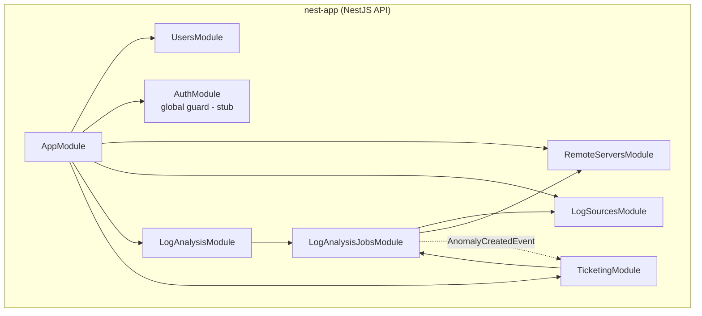

# Server Monitor

A monitoring backend that ingests server/application logs, detects anomalies, and (optionally) raises tickets in an external ticketing system. Built as a [pnpm](https://pnpm.io) monorepo around a NestJS API, with a companion log-generator for testing the full pipeline.

## Documentation

| Doc | What's inside |
|-----|---------------|
| [docs/IMPLEMENTATION.md](docs/IMPLEMENTATION.md) | **What is implemented** — module-by-module reference of every feature, entity, and endpoint, plus an honest split of working features vs. stubs/gaps. |
| [docs/APP_FLOW.md](docs/APP_FLOW.md) | **The app flow** — how data moves end to end: log → ingest → anomaly → event → ticket, with sequence and lifecycle diagrams. |

## Apps

| App | Path | Role | Stack |
|-----|------|------|-------|
| API | [`apps/nest-app`](apps/nest-app) | REST API: servers, log sources, analysis jobs, anomalies, ticketing | NestJS 11, TypeORM + better-sqlite3, event-emitter, Swagger |
| Log generator | [`apps/dummy-log-generator`](apps/dummy-log-generator) | Emits logs and forwards errors into the API (for testing) | Express + Winston, Fluent Bit sidecar, Docker |

## Module overview



The dotted arrow is the in-process event bus (`@nestjs/event-emitter`): log analysis emits `AnomalyCreatedEvent` and ticketing reacts to it — the two never call each other directly.

## Getting started

```bash
# install workspace dependencies
pnpm install

# run the API (from apps/nest-app)
pnpm --filter nest-app start:dev      # http://localhost:3000  •  Swagger at /api

# run the log generator (optional, for end-to-end testing)
pnpm --filter dummy-log-generator dev # http://localhost:3100
```

To exercise the full pipeline, point the log generator's Fluent Bit output at a real job id — see the Docker setup and `LOG_ANALYSIS_JOB_ID` in [`apps/dummy-log-generator/docker-compose.yml`](apps/dummy-log-generator/docker-compose.yml), and the flow walkthrough in [docs/APP_FLOW.md](docs/APP_FLOW.md).

## Status

Core CRUD, log ingestion, anomaly deduplication, and the event-driven ticketing path are implemented. Authentication, real ticketing-provider integrations, and live log-source polling are currently stubbed — see the **Stubs & gaps** section of [docs/IMPLEMENTATION.md](docs/IMPLEMENTATION.md#4-stubs--gaps-implemented-vs-not-yet-wired).
