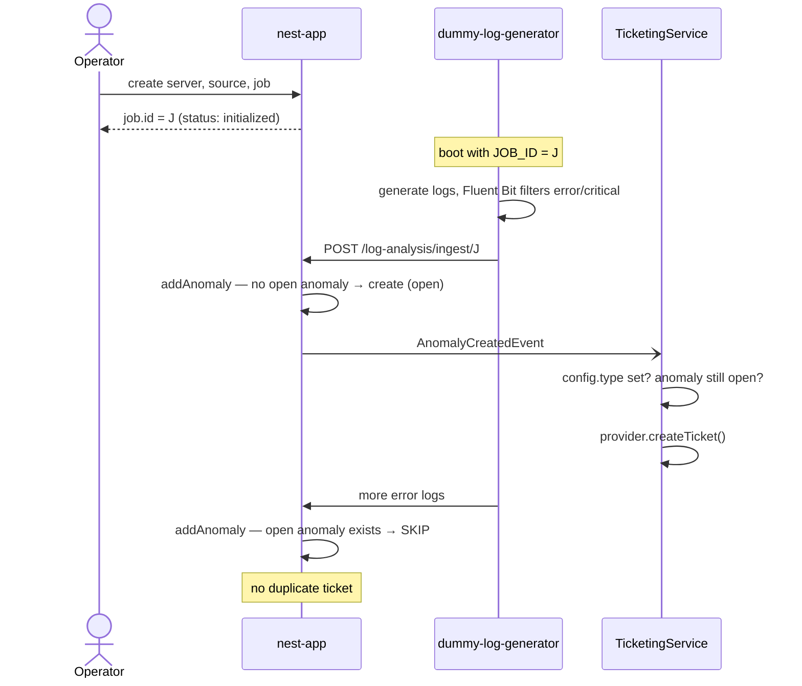
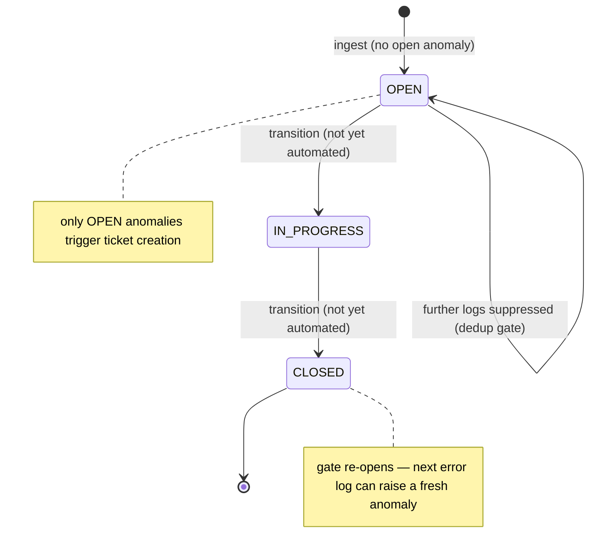

# Server Monitor — Application Flow

How data moves through the system, end to end: from a log being produced, to an anomaly being recorded, to a ticket being created.

---

## 1. The big picture

```
┌──────────────────────────┐         ┌───────────────────────────────────────────┐
│   dummy-log-generator     │         │                 nest-app                    │
│                           │         │                                             │
│  Express + Winston        │         │   POST /log-analysis/ingest/:jobId          │
│   writes JSON logs ──────►│  logs/  │            │                                │
│                           │  *.log  │            ▼                                │
│  Fluent Bit               │         │   LogAnalysisService.ingestLogs()           │
│   tail → grep(error|crit) │ ─HTTP─► │            │                                │
│   → HTTP POST             │         │            ▼                                │
└──────────────────────────┘         │   LogAnalysisJobsService.addAnomaly()       │
                                      │       │  (dedupe: skip if open anomaly)     │
                                      │       ▼                                     │
                                      │   emit AnomalyCreatedEvent ──┐              │
                                      │                              ▼              │
                                      │              TicketingService.@OnEvent      │
                                      │                              │              │
                                      │                              ▼              │
                                      │         TicketingProviderFactory.create()   │
                                      │                              │              │
                                      │                              ▼              │
                                      │            provider.createTicket()  (stub)  │
                                      └───────────────────────────────────────────┘
```

Rendered:



```mermaid
flowchart LR
    subgraph gen["dummy-log-generator (container)"]
        winston["Express + Winston<br/>writes JSON logs"] --> files[("logs/*.log")]
        files --> fb["Fluent Bit<br/>tail → grep(error|critical)"]
    end

    subgraph api["nest-app"]
        ingest["POST /log-analysis/ingest/:jobId"] --> svc["LogAnalysisService.ingestLogs()"]
        svc --> add["LogAnalysisJobsService.addAnomaly()<br/>(dedupe: skip if open anomaly)"]
        add -->|"emit"| evt(["AnomalyCreatedEvent"])
        evt -.->|"@OnEvent"| tkt["TicketingService"]
        tkt --> factory["TicketingProviderFactory.create()"]
        factory --> provider["provider.createTicket() — stub"]
    end

    fb -->|"HTTP POST"| ingest
```

The two halves are decoupled twice over:
1. **Logs → API** via Fluent Bit's HTTP output (network boundary).
2. **Anomaly → Ticket** via an **in-process event** (`AnomalyCreatedEvent`), so log analysis never calls ticketing directly.

---

## 2. Setup flow (configuring the system)

Before any logs are processed, an operator configures the resources. Every request passes through the global `AuthGuard`, which (today) attaches the fixed user `default-user-1` as the owner.

```
1. POST /remote-servers          → register the host being monitored
        { name, description?, config }
        → stored with status = "unknown", ownerId = default-user-1

2. POST /log-sources   (optional) → register where logs originate
        { name, type: zabbix|prometheus, config, description? }
        → stored with status = "unknown"

3. POST /log-analysis-jobs        → create the analysis job
        { name, type: one_time|recurring,
          remoteServerId,                  (required, validated to exist)
          logSourceId?,                    (optional, validated if present)
          ticketingSystemConfig? }         (e.g. { type: "ServiceNowTicketingProvider", ... })
        → stored with status = "initialized"; returns the job id
```

The returned **job id** is the linchpin: it's what logs are ingested against and what the ticketing config travels with.

---

## 3. Log production & forwarding (dummy-log-generator)

This app stands in for a real monitored application.

```
On container boot:
  • Node/Express starts on :3100
  • Winston begins writing JSON logs to logs/combined.log and logs/error.log
  • Normal-log loop (info/debug/warn, weighted) auto-starts   — every 1–5s
  • Error-log loop (error level, with stack traces) auto-starts — every 2–8s

  You can also drive it manually:
    POST /generate-error      → one error
    POST /generate-batch      → up to 50 errors
    POST /start|stop-generation, /start|stop-error-generation

In parallel, Fluent Bit (same container):
  1. tail   — reads new lines from /app/logs/*.log, parses each as JSON
  2. grep   — keeps ONLY records where level == "error" or "critical"
  3. http   — POSTs the surviving records as JSON to:
              http://host.docker.internal:3000/log-analysis/ingest/<LOG_ANALYSIS_JOB_ID>
```

`LOG_ANALYSIS_JOB_ID` is injected via `docker-compose.yml`, so all forwarded errors land against one specific analysis job.

---

## 4. Ingestion → anomaly (the core path)

When error logs arrive at the API:

```
POST /log-analysis/ingest/:jobId   (body: array of log records)
        │
        ▼
LogAnalysisController.ingestLogs(jobId, currentUser.id, body)
        │
        ▼
LogAnalysisService.ingestLogs()
        │  • look up the job for this owner; 404 if not found
        │  • for each log record:
        │       message = log.message ?? "Untitled Log Message"
        │       level   = log.level   ?? "error"
        │       severity = (level === "critical") ? HIGH : MEDIUM
        ▼
LogAnalysisJobsService.addAnomaly(job, { title, description, severity })
        │
        │   ┌─────────────── DEDUPLICATION GATE ───────────────┐
        │   │ Does this job already have an anomaly that is     │
        │   │ "open" or "in_progress"?                          │
        │   │   • YES → return early, do nothing                │
        │   │   • NO  → create a new anomaly (status = "open")  │
        │   └───────────────────────────────────────────────────┘
        ▼
   save Anomaly  →  emit AnomalyCreatedEvent { ownerId, jobId, anomalyId }
```

**Why the dedup gate matters:** a flood of error logs for the same job produces **at most one open anomaly at a time**. No new anomaly (and therefore no new ticket) is raised until the current one is closed. This is the system's noise-suppression mechanism.

---

## 5. Anomaly → ticket (the event-driven path)

The emitted event is handled asynchronously by the ticketing module.

```
AnomalyCreatedEvent { ownerId, jobId, anomalyId }
        │
        ▼
TicketingService.handleAnomalyCreatedEvent()   (@OnEvent)
        │
        ├─ 1. config = job.ticketingSystemConfig
        │      └─ if no config.type → STOP (this job has ticketing disabled)
        │
        ├─ 2. provider = TicketingProviderFactory.create(config)
        │      └─ switch on config.type:
        │           "ServiceNowTicketingProvider" → new ServiceNowTicketingProvider(config)
        │           anything else                 → throw "Unsupported provider"
        │
        ├─ 3. anomaly = getAnomaly(anomalyId, ownerId)
        │      └─ if missing or status !== "open" → STOP
        │
        └─ 4. provider.createTicket({
                  title, description,
                  severity: map(anomaly.severity)   // low/medium/high → ticket severity
              })
              └─ ServiceNowTicketingProvider returns a STUB ticket today
                 (id "random-id", status "open"); not persisted back to the anomaly
```

Ticketing is **opt-in per job**: only jobs created with a `ticketingSystemConfig.type` ever produce tickets.

---

## 6. End-to-end sequence (happy path)

```
Operator         API (nest-app)                         dummy-log-generator
   │                  │                                          │
   │ create server,   │                                          │
   │ source, job ────►│  job.id = J, status=initialized          │
   │                  │                                          │
   │                                       boot with JOB_ID=J ──►│ generates logs
   │                                                             │ Fluent Bit filters
   │                  │◄── POST /log-analysis/ingest/J ──────────│ (error/critical only)
   │                  │                                          │
   │                  │ addAnomaly:                              │
   │                  │   no open anomaly → create one (open)    │
   │                  │   emit AnomalyCreatedEvent               │
   │                  │        │                                 │
   │                  │        └─► TicketingService              │
   │                  │              config.type set?            │
   │                  │              anomaly still open?         │
   │                  │              → provider.createTicket()   │
   │                  │                                          │
   │                  │◄── more error logs ──────────────────────│
   │                  │ addAnomaly: open anomaly exists → SKIP   │
   │                  │ (no duplicate ticket)                    │
```

Rendered:



---

## 7. Lifecycle states

**Anomaly status** drives both dedup and ticketing:

```
        (ingest, no open anomaly)
   ─────────────────────────────────►  OPEN
                                         │   ▲
                       (further logs suppressed while OPEN)
                                         │
                              (manual/ future transition)
                                         ▼
                                    IN_PROGRESS ──► CLOSED
```

Rendered:



- New anomalies start **OPEN**.
- While an anomaly is **OPEN** or **IN_PROGRESS**, the dedup gate blocks new anomalies for that job.
- Only **OPEN** anomalies trigger ticket creation.
- `CLOSED` re-opens the gate, so the next error log can raise a fresh anomaly.

> Note: transitions out of `OPEN` (to `in_progress`/`closed`) are not yet automated in the code — the `PATCH /log-analysis-jobs/:id` endpoint and entities support the data, but no flow drives the anomaly status changes today.

**Job status** (`initialized → pending → running → completed/failed`) is currently set to `initialized` on creation and not advanced by any flow yet.

---

## 8. Boundaries & contracts at a glance

| Boundary | Mechanism | Contract |
|---|---|---|
| Logs → API | Fluent Bit HTTP output | JSON array → `POST /log-analysis/ingest/:jobId` |
| Ingest → anomaly | direct service call | `{ message, level }` → anomaly `{ title, severity }` |
| Anomaly → ticketing | in-process event | `AnomalyCreatedEvent { ownerId, jobId, anomalyId }` |
| Ticketing → external | provider interface | `ITicketingProvider.createTicket()` (ServiceNow stub) |
| Every request → owner | global `AuthGuard` | injects `default-user-1` (stubbed auth) |
